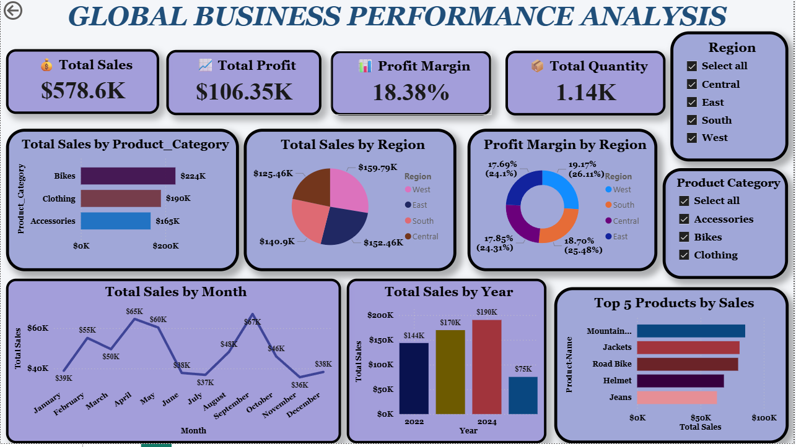

# 🌍 Global Business Performance Analysis (Power BI)

Developed a comprehensive executive-level Power BI dashboard to monitor key business metrics, including revenue, profit margins, and regional return rates, using simulated datasets. Utilized Power Query for efficient ETL processes and DAX for creating advanced, dynamic measures. The dashboard provides actionable insights into customer behavior, product performance, and seasonal demand trends, enabling data-driven decision-making for inventory management, returns optimization, and supply chain strategy.

## 🎯 Project Objective
Develop an **interactive Power BI dashboard** that helps businesses:  
- Track total sales, profit, and quantities by product and region  
- Identify high-performing and underperforming areas  
- Visualize monthly and yearly trends, i.e, Total sales by Months and Years.
- Enable **data-driven decision-making** for strategic growth

  ## 🛠 Tools & Technologies
- **Power BI Desktop** – Dashboard creation and reporting  
- **Power Query** – Data cleaning and ETL transformations  
- **DAX (Data Analysis Expressions)** – Dynamic KPI and metric calculations  
- **Excel/CSV** – Raw dataset source  

## 🔹 Key Features
- **Cleaned & Transformed Data:** Removed duplicates, handled missing values, and structured the dataset for analysis  
- **Dynamic KPIs & DAX Measures:**  
  - Total Sales, Total Profit, Profit Margin %, Total Quantity  
  - Measures update automatically with slicers and filters  
- **Interactive Visualizations:**  
  - KPI cards for top metrics  
  - Bar/Column charts for regional and product comparison  
  - Line charts for trend analysis  
  - Pie/Donut charts for market share breakdown  
- **Slicers & Bookmarks:** Easy filtering by Region, Product, and Time; drill-through for detailed insights  
- **Business Insights:** Identified top-performing products and regions, highlighted opportunities for optimization  

---

## 📊 Dashboard Screenshots

## 💡 Business Impact
- Enables fast, actionable decisions for sales and marketing teams  
- Helps optimize inventory and resource allocation  
- Consolidates key KPIs into one interactive, easy-to-use dashboard  
- Demonstrates analytical thinking and problem-solving  

---

## ⚡ Challenges & Learnings
| Challenge | Solution / Learning |
|-----------|-------------------|
| Inconsistent or missing data | Cleaned and transformed using Power Query; replaced nulls with default values |
| Dynamic calculations with filters | Built advanced DAX measures for metrics that update across slicers |
| Dashboard interactivity | Implemented bookmarks, drill-through, and dynamic visuals for better storytelling |

---

## 🔮 Future Enhancements
- Implement **predictive analytics** with time-series forecasting  
- Add **row-level security (RLS)** for multi-user access control  
- Connect to **live databases** for real-time performance dashboards  
- Optimize performance for **large-scale datasets**  

---
